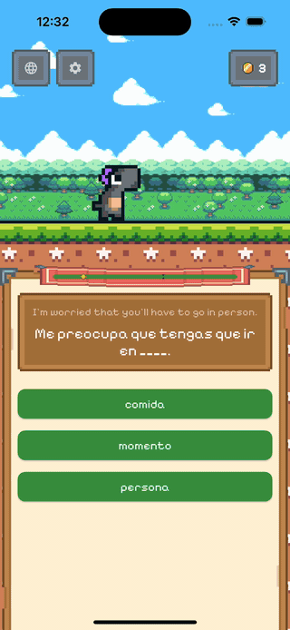

# Lexaway

<p align="center">
  
</p>

A language learning adventure game built with Flutter and Flame. Answer questions, walk a tiny dino across pixel-art landscapes.

<p align="center">
  <a href="https://apps.apple.com/us/app/lexaway/id6761870125"></a>
  &nbsp;
  <a href="https://play.google.com/store/apps/details?id=com.lexaway.app"></a>
</p>

## LLM Usage

LLMs are used to help develop this app and its related lexaway-packs repo.

Suggestions and code edits are always reviewed and nothing is done fully "hands-off".

## Running

```bash
flutter run
```

## Testing

```bash
# Unit / widget tests
flutter test

# Integration tests (single device)
flutter drive --driver=test_driver/integration_test.dart \
  --target=integration_test/screenshot_test.dart
```

## Store Screenshots

Full pipeline — captures raw screenshots across iOS simulators and Android emulators, then composites marketing assets with dithered scrims and captions:

```bash
uv run --with pyyaml store/screenshots.py
```

Useful flags for iteration:

```bash
# iOS only / Android only
uv run --with pyyaml store/screenshots.py --platform ios
uv run --with pyyaml store/screenshots.py --platform android

# Capture only (skip compose step)
uv run --with pyyaml store/screenshots.py --capture-only

# Compose only (re-process existing raw screenshots)
uv run --with pyyaml store/screenshots.py --compose-only

# Single device
uv run --with pyyaml store/screenshots.py --device iPhone_16_Plus

# Combine flags
uv run --with pyyaml store/screenshots.py --platform ios --device iPhone_16_Plus --capture-only
```

Device list, captions, and style are configured in `store/screenshot_config.yaml`.

Output lands in `screenshots/raw/` (captures) and `screenshots/final/` (composed).

## Native Splash Screen

Regenerate after changing the config in `pubspec.yaml`:

```bash
dart run flutter_native_splash:create
```
